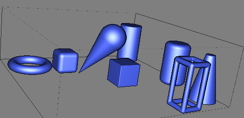

IcestoneSL
==========

A library to extends [IceSL](http://webloria.loria.fr/~slefebvr/icesl/) with higher-level primitives.

[IceSL](http://webloria.loria.fr/~slefebvr/icesl/) is a modeler *à la* [OpenSCAD](http://www.openscad.org/) but the programming language is [Lua](http://www.lua.org/). But it is also a slicer with advanced features such as supports.

[IcestoneSL](https://github.com/loic-fejoz/IcestoneSL) provides same primitives as [Shapes.inc](http://www.povray.org/documentation/view/3.7.0/468/) from [POVRay](http://www.povray.org/).

It will provide more in the future. Stay tune!

Examples
--------

All those shapes are generated by calling a unique primitive (really lua function) build upon IceSL's one.

Installation
------------

TODO

Usage
-----

Simply add `require "povray";` on top of your file.